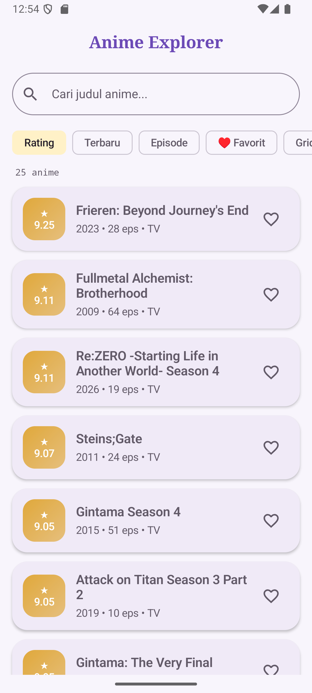
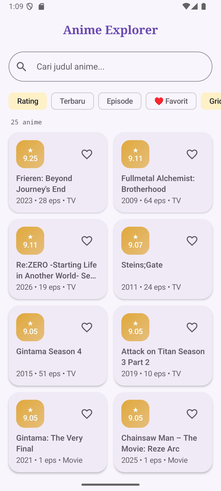
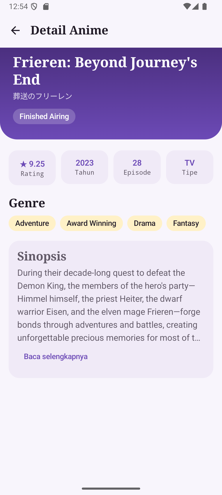

# Anime Explorer

Aplikasi Android sederhana untuk mengeksplorasi anime. Data diambil secara dinamis dari **Tenrai API** dan ditampilkan dengan **Jetpack Compose**, **Material 3**, **Navigation**, dan arsitektur **MVVM**.

Dibuat untuk responsi Praktikum Pemrograman Mobile (IF21507) oleh **Aisyah (H1D024128)**, Teknik Informatika, Universitas Jenderal Soedirman.

---

## Screenshot

| Home (List) | Home (Grid) | Detail |
|:-----------:|:-----------:|:------:|
|  |  |  |

> Letakkan file gambar di folder `screenshots/` pada root repository.

---

## Fitur

- Daftar anime top dari API: **judul, rating, tahun rilis, jumlah episode**
- Halaman detail: tipe, status, genre, dan sinopsis (bisa dibuka/tutup)
- Pencarian judul secara langsung
- Pengurutan berdasarkan **Rating**, **Terbaru**, atau **Episode**
- Tandai anime **favorit** dan filter favorit saja
- Ganti tampilan **List ↔ Grid**
- Tiga state UI: **Loading** (skeleton), **Error** (dengan tombol coba lagi), dan **Data**
- Tema terang dan gelap mengikuti sistem

---

## Teknologi

| Komponen | Yang digunakan |
|----------|----------------|
| Bahasa | Kotlin |
| UI | Jetpack Compose, Material Design 3 |
| Navigasi | Navigation Compose |
| Arsitektur | MVVM (Model, View, ViewModel, Repository) |
| State | `StateFlow` + `collectAsState` |
| Networking | Retrofit 2 + Gson Converter |
| API | [Tenrai API](https://api.tenrai.org/documentation) (`https://api.tenrai.org/v1`) |

Tidak memakai XML layout, database, autentikasi, maupun library pemuat gambar.

---

## Arsitektur (MVVM)

```
          ┌──────────────┐   event (klik, ketik)   ┌───────────────┐
          │     View     │ ──────────────────────► │   ViewModel   │
          │ (Compose UI) │ ◄────────────────────── │  (StateFlow)  │
          └──────────────┘     state (UiState)     └───────┬───────┘
                                                           │ panggil
                                                   ┌───────▼───────┐
                                                   │  Repository   │
                                                   └───────┬───────┘
                                                           │
                                                   ┌───────▼───────┐
                                                   │ Retrofit API  │──► Tenrai API
                                                   └───────────────┘
```

Alur data satu arah: **View** hanya mengamati state dan mengirim event, **ViewModel** mengelola state, **Repository** menjadi satu-satunya pintu akses data, dan **API Service** berkomunikasi dengan server.

### Struktur folder

```
com.pemmob.h1d024128.animeexplorer
├── MainActivity.kt
├── data
│   ├── model/Anime.kt                  # data class + extension function
│   ├── remote/TenraiApiService.kt      # definisi endpoint Retrofit
│   ├── remote/RetrofitInstance.kt      # konfigurasi Retrofit (singleton)
│   └── repository/AnimeRepository.kt
└── ui
    ├── UiState.kt                      # Loading / Success / Error
    ├── components/CommonComponents.kt  # komponen UI yang dipakai ulang
    ├── navigation/AnimeNavigation.kt
    ├── home/HomeScreen.kt, HomeViewModel.kt
    ├── detail/DetailScreen.kt, DetailViewModel.kt
    └── theme/Color.kt, Theme.kt, Type.kt
```

---

## Penjelasan Teknis

### 1. Model (`data/model/Anime.kt`)
Respons API dipetakan ke **data class** (`AnimeListResponse`, `AnimeDetailResponse`, `Anime`). Field yang bisa kosong dari API dibuat **nullable** (`String?`, `Double?`, `Int?`) agar aplikasi tidak crash. `@SerializedName` memetakan nama JSON seperti `mal_id` ke properti Kotlin `malId`.

Dua **extension function** menangani nilai kosong dengan operator elvis (`?:`):
- `releaseYear()` memakai `year`, dan jika kosong memakai tahun dari tanggal tayang pertama.
- `displayTitle()` memilih judul Inggris, lalu judul biasa, lalu judul Jepang.

### 2. Networking (`data/remote`)
- `TenraiApiService` adalah interface Retrofit dengan dua fungsi `suspend`:
    - `GET top/anime?limit=25` untuk daftar anime
    - `GET anime/{id}` untuk detail anime
- `RetrofitInstance` membuat satu instance Retrofit secara `lazy` dengan base URL `https://api.tenrai.org/v1/` dan `GsonConverterFactory`.

### 3. Repository (`data/repository/AnimeRepository.kt`)
Membungkus pemanggilan API dan mengembalikan objek `Anime` langsung. ViewModel tidak perlu tahu detail Retrofit.

### 4. State (`ui/UiState.kt`)
`sealed interface UiState<out T>` dengan tiga kemungkinan: `Loading`, `Success(data)`, dan `Error(message)`. Fungsi `Throwable.toUserMessage()` mengubah exception teknis (tidak ada koneksi, error server) menjadi pesan yang mudah dipahami.

### 5. ViewModel
**`HomeViewModel`** menyimpan beberapa `MutableStateFlow`: data mentah dari API, filter (kata kunci, urutan, favorit saja), daftar favorit, dan mode grid. Properti `uiState` dibuat dengan **`combine(...)`** yang menggabungkan data API dengan filter dan favorit, lalu diubah menjadi `StateFlow` lewat `stateIn`. Pencarian, penyaringan, dan pengurutan memakai **lambda** dan **collection** (`filter`, `sortedByDescending`, `let`).

**`DetailViewModel`** memuat satu anime berdasarkan id dan mengekspos `StateFlow<UiState<Anime>>`.

Pemanggilan API dibungkus `try-catch`, dan `CancellationException` dilempar ulang agar coroutine dibatalkan dengan benar.

### 6. UI (Jetpack Compose + Material 3)
- **`HomeScreen`**: `Scaffold`, `OutlinedTextField` untuk pencarian, `FilterChip` untuk urutan/favorit/grid, serta `LazyColumn` atau `LazyVerticalGrid` untuk daftar. Blok `when (state)` menampilkan skeleton saat Loading, `ErrorView` saat Error, dan daftar saat Success. Item memakai `key` dan `Modifier.animateItem()` agar perubahan urutan teranimasi.
- **`DetailScreen`**: header gradasi, kotak statistik, genre dengan `FlowRow`, dan sinopsis yang bisa dibuka/tutup memakai `animateContentSize`.
- **`CommonComponents.kt`**: `ScoreBadge`, `Pill`, `FavoriteButton` (animasi warna dan skala), `LoadingView`, `ErrorView`, dan `SkeletonCard` (animasi berkedip).

### 7. Navigation (`ui/navigation/AnimeNavigation.kt`)
`NavHost` dengan dua layar saja:
- `home` untuk daftar anime
- `detail/{animeId}` untuk detail, dengan argumen `animeId` bertipe `Int`

### 8. Theme
- `Color.kt`: palet warna ungu, emas, dan pink
- `Theme.kt`: `lightColorScheme` dan `darkColorScheme` dalam `AnimeExplorerTheme`
- `Type.kt`: **custom typography** (Serif untuk judul, SansSerif untuk isi, Monospace untuk label)

### Fitur Kotlin yang dimanfaatkan
- **Data class**: `Anime`, `Genre`, `HomeFilter`, dan lainnya
- **Null safety**: tipe nullable, `?.`, `?:`, dan `?.let`
- **Lambda**: `filter`, `sortedByDescending`, `mapNotNull`, event handler Compose
- **Collection**: `List`, `Set` untuk favorit, `listOfNotNull`, `joinToString`
- **Lainnya**: sealed interface, enum class, extension function, dan coroutine

---

## Cara Menjalankan

1. Clone repository ini:
   ```bash
   git clone https://github.com/<username>/<nama-repo>.git
   ```
2. Buka folder proyek di **Android Studio**.
3. Tunggu proses **Gradle Sync** selesai.
4. Jalankan di emulator atau perangkat Android (**minSdk 29**). Perangkat harus terhubung ke internet.

---

## Ketentuan Responsi yang Dipenuhi

- [x] Kotlin: data class, null safety, lambda, collection
- [x] Jetpack Compose, Material 3, Custom Theme, Custom Typography
- [x] `LazyColumn` dan `LazyVerticalGrid`, data dari API
- [x] Tenrai API, menampilkan judul, rating, tahun rilis, dan jumlah episode
- [x] MVVM: Model, View, ViewModel, Repository
- [x] Maksimal 2 screen (Home dan Detail)
- [x] State UI: Data, Loading, Error
- [x] Tanpa XML layout, database, login, dan image loading